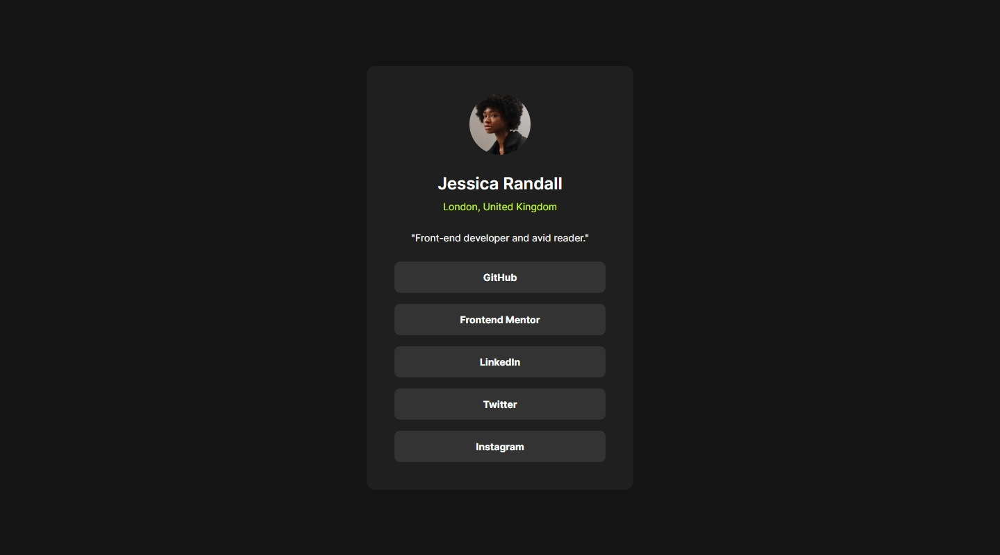
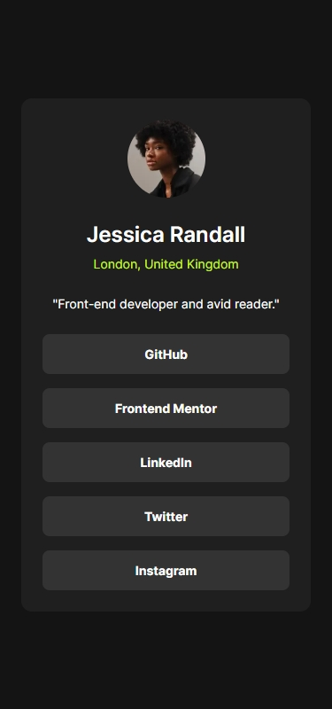

## Frontend Mentor Challenge 16 - Social Links Profile

This is my solution to the [Social Links Profile](https://www.frontendmentor.io/challenges/social-links-profile-UG32l9m6dQ) challenge on [Frontend Mentor](https://www.frontendmentor.io/).

### Screenshots of the Solution (Desktop & Mobile). 🔍




#

### Links. 🔗

- Live Site URL: https://social-links-profile-darkstarxdd.vercel.app/

#

### Built with. 🔨

- HTML.
- Tailwind.
- Vite.

#

### Testing and Accessibility. 🧪

- Used the Responsively App to check the site's appearance on various screen sizes, from 320x480 to 3000x2000.
- Set the browser font size on desktop to various values ranging from 9px to 56px to ensure everything on the site scales properly with the user's preferred browser font size.
- Zoomed the page in and out using Ctrl + Scroll wheel (up to 500%).
- Tested with the NVDA screen reader.
- Viewed the site on an iPhone 11.
- Performed Lighthouse and PageSpeed tests. ([PageSpeed Result](https://pagespeed.web.dev/analysis/https-social-links-profile-darkstarxdd-vercel-app/ybod71u73d?form_factor=mobile))

#

### New Things Learned. 🎓

- Using `@apply` to add utility classes to my custom classes defined inside the `styles.css` file.

  ```css
  @layer base {
    *:focus-visible {
      @apply outline-[0.125rem] outline-dotted outline-primary-400 outline-offset-[0.125rem];
    }
  }
  ```

#

### Ending Notes. 📝

- After my previous project, which was my first Tailwind project, I wanted to do another small component project using Tailwind to become more familiar with it.

- The padding between the edges of the container and the content were different in mobile screens and desktop screens. I got the result using a `clamp()`, so I could skip having a media query only for that value.
  ```css
  @layer utilities {
    .p-clamped {
      padding: clamp(1.5rem, 5vw, 2.5rem);
    }
  }
  ```

#

### Tools I Use. 🔧

- [Prettier VS Code Extension](https://marketplace.visualstudio.com/items?itemName=esbenp.prettier-vscode) - Code formatter.

- [Responsively.app](https://responsively.app/) - A free and open source tool that allows you to test your webpage on different screen sizes, take screenshots and much more.

- [Color Contrast Checker by coolors.co](https://coolors.co/contrast-checker/112a46-acc8e5) - Check color contrast ratios and if needed, update the colors to match the WCAG guidelines.

- [Google Webfonts Helper by Mario Ranftl](https://gwfh.mranftl.com/fonts) - Provides WOFF2 format for Google Fonts.

- [PerfectPixel by WellDoneCode](https://chromewebstore.google.com/detail/perfectpixel-by-welldonec/dkaagdgjmgdmbnecmcefdhjekcoceebi) - A chrome extension that enables you to overlay an image, over a webpage. This makes it easier to compare your solution result with the reference image and adjust fine details if needed.

#

- My Frontend Mentor Profile - [@DarkstarXDD](https://www.frontendmentor.io/profile/DarkstarXDD)
